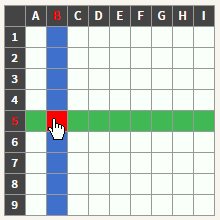
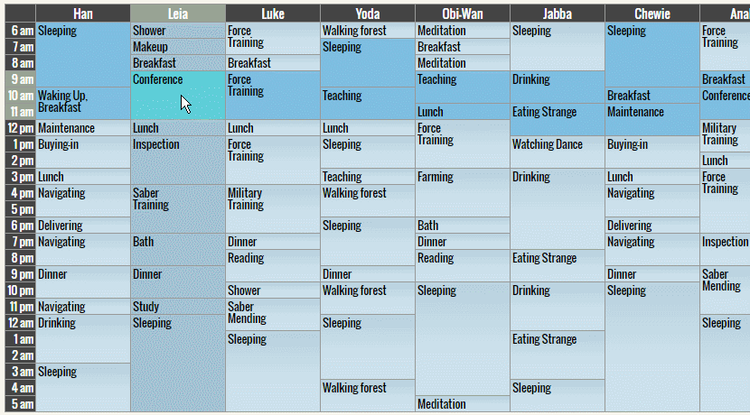

# getTable

The simple jQuery Plugin for easy getting the table cells that are positioned on the horizontal line, the vertical line or both lines that pass through the target cell.

[](https://anseki.github.io/jquery-gettable/)  
[](https://anseki.github.io/jquery-gettable/)

**See <a href="https://anseki.github.io/jquery-gettable/">DEMO</a>**

+ getTable gets the horizontal line (`row`) and the vertical line (`col`) of the table. And it gets cells that are positioned on those lines. The handling cells that are positioned on the horizontal line is supported by `<tr>` HTML tag, but the vertical line is not supported by the HTML.
+ The cells that are extended by `colspan`/`rowspan` are parsed correctly. More lines pass through the extended cells (i.e. those cells catch more cells), and those cells are positioned on more lines (i.e. those cells are caught by more cells).
+ The horizontal line (`row`) and the vertical line (`col`) are discerned. getTable returns a jQuery object (or Array of those), therefore you can do anything you want to those.
+ The table is parsed via DOM, it's fast, correctly, and those data are cached.

```js
// Get rows that include target cell.
rows = $('td#target').getTable('rows');

// Get cols that include target cell.
cols = $('td#target').getTable('cols');

// Get cells that are included in the cross line (rows and cols) of target cell.
// And style those.
cells = $('td#target').getTable('xCells').css('backgroundColor', 'blue');
```

## Getting Started
Load after jQuery.

```html
<script src="jquery-1.11.0.min.js"></script>
<script src="jquery.gettable.min.js"></script>
```

## Methods

### `rows`

```js
rows = target.getTable('rows')
```

Return an Array that includes zero or more `row`s. The `row` is a jQuery object that includes zero or more `cell` (`<td>` or `<th>`) elements that are positioned on a horizontal line. The `cell`s in the `row` are sorted by position as from left to right, regardless of the HTML source order. For example, `row.eq(0)` is leftmost `cell` like the header.  
*(If you want to do something to all `cell`s in `rows` together (you want to do nothing to each `row`), use [`rowsCells`](#rowscells) method.)*  
The elements are selected according to the each element that is included in current target jQuery object. The returned `rows` is one Array that includes all of those.

An element that is included in current target jQuery object is:

+ **`table`** (`<table>` element)  
e.g. `$('table#target').getTable('rows')`  
All `row`s in this `table` are selected.
+ **`row`** (`<tr>` element)  
e.g. `$('tr#target').getTable('rows')`  
This `row` itself is selected.  
The `cell` elements in this `row` are not the same as `cell` elements in `<tr>` element, which includes `cell`s that are extended by `rowspan` in previous `<tr>`.
+ **`cell`** (`<td>` or `<th>` element)  
e.g. `$('td#target').getTable('rows')`  
All `row`s that include this `cell` (i.e. horizontal lines that pass through this `cell`) are selected.  
*(If you want both `rows` and `cols` of `cell`, use [`xCells`](#xcells) method.)*  
For example:

```js
var hl; // keep to restore
$('td').hover(function() {
  hl = $(this).getTable('rows')[0].addClass('highlight');
}, function() {
  hl.removeClass('highlight');
});
```

+ **`section`** (`<thead>`, `<tfoot>` or `<tbody>` element)  
e.g. `$('thead#target').getTable('rows')`  
All `row`s in this `section` are selected.

In any cases, the nested `table` (`table` that is included in current target) is excluded (If part of the nested `table` is target too, of course it is included).

### `rowsCells`

```js
cells = target.getTable('rowsCells')
```

Return a jQuery object that includes zero or more `cell` (`<td>` or `<th>`) elements that are included in all `row`s that selected by same way as [`rows`](#rows) method. The returned `cells` is one jQuery object that includes all of those.  
*(If you want to do something to each `row` (you want to do nothing to all `cell`s in `rows` together), use [`rows`](#rows) method.)*

This is not the same as merged all `cell`s that are returned by [`rows`](#rows) method, `rowsCells` method returns unique `cell`s, duplicated elements are excluded.

### `cols`

```js
cols = target.getTable('cols')
```

Return an Array that includes zero or more `col`s. The `col` is a jQuery object that includes zero or more `cell` (`<td>` or `<th>`) elements that are positioned on a vertical line. The `cell`s in the `col` are sorted by position as from top to bottom, regardless of the HTML source order. For example, `col.eq(0)` is uppermost `cell` like the header.  
*(If you want to do something to all `cell`s in `cols` together (you want to do nothing to each `col`), use [`colsCells`](#colscells) method.)*  
The elements are selected according to the each element that is included in current target jQuery object. The returned `cols` is one Array that includes all of those.

An element that is included in current target jQuery object is:

+ **`table`, `row`, `section`** (`<table>`, `<tr>`, `<thead>`, `<tfoot>` or `<tbody>` element)  
e.g. `$('thead#target').getTable('cols')`  
All `col`s in this `table` are selected.
+ **`cell`** (`<td>` or `<th>` element)  
e.g. `$('td#target').getTable('cols')`  
All `col`s that include this `cell` (i.e. vertical lines that pass through this `cell`) are selected.  
*(If you want both `rows` and `cols` of `cell`, use [`xCells`](#xcells) method.)*  
For example:

```js
var hl; // keep to restore
$('td').hover(function() {
  hl = $(this).getTable('cols')[0].addClass('highlight');
}, function() {
  hl.removeClass('highlight');
});
```

In any cases, the nested `table` (`table` that is included in current target) is excluded (If part of the nested `table` is target too, of course it is included).

### `colsCells`

```js
cells = target.getTable('colsCells')
```

Return a jQuery object that includes zero or more `cell` (`<td>` or `<th>`) elements that are included in all `col`s that selected by same way as [`cols`](#cols) method. The returned `cells` is one jQuery object that includes all of those.  
*(If you want to do something to each `col` (you want to do nothing to all `cell`s in `cols` together), use [`cols`](#cols) method.)*

This is not the same as merged all `cell`s that are returned by [`cols`](#cols) method, `colsCells` method returns unique `cell`s, duplicated elements are excluded.

### `cells`

```js
cells = target.getTable('cells')
```

Return a jQuery object that includes zero or more `cell` (`<td>` or `<th>`) elements. The elements are selected according to the each element that is included in current target jQuery object. The returned `cells` is one jQuery object that includes all of those.

An element that is included in current target jQuery object is:

+ **`table`** (`<table>` element)  
e.g. `$('table#target').getTable('cells')`  
All `cell`s in this `table` are selected.
+ **`row`** (`<tr>` element)  
e.g. `$('tr#target').getTable('cells')`  
All `cell`s in this `row` are selected.  
This is not the same as `cell` elements in `<tr>` element, which includes `cell`s that are extended by `rowspan` in previous `<tr>`.  
For example:

```js
$('#targetRow').getTable('cells').css('backgroundColor', 'blue');
```

+ **`cell`** (`<td>` or `<th>` element)  
e.g. `$('td#target').getTable('cells')`  
This `cell` itself is selected.
+ **`section`** (`<thead>`, `<tfoot>` or `<tbody>` element)  
e.g. `$('thead#target').getTable('cells')`  
All `cell`s in this `section` are selected.

In any cases, the nested `table` (`table` that is included in current target) is excluded (If part of the nested `table` is target too, of course it is included).

### `xCells`

```js
cells = target.getTable('xCells')
```

Return a jQuery object that includes zero or more `cell` (`<td>` or `<th>`) elements that are positioned on the cross line (horizontal line and vertical line) that pass through the each element that is included in current target jQuery object. The returned `cells` is one jQuery object that includes all of those. The first `cell` of that `cells` is current target. i.e. `cells.eq(0)` is a `cell` on the cross point.  
The elements that are not `cell` (`<td>` or `<th>`) are ignored.

This is not the same as merged all `cell`s that are returned by [`rows`](#rows) method and [`cols`](#cols) method, `xCells` method returns unique `cell`s, duplicated elements are excluded.

The nested `table` (`table` that is included in current target) is excluded (If part of the nested `table` is target too, of course it is included).

For example:

```js
var hl; // keep to restore
$('td').hover(function() {
  hl = $(this).getTable('xCells').addClass('highlight');
}, function() {
  hl.removeClass('highlight');
});
```

### `table`

```js
table = target.getTable('table')
```

Return a jQuery object that includes zero or more `table` (`<table>`) elements. The `<table>` elements that are included in current target jQuery object, and the `<table>` elements that have `<tr>`, `<td>`, `<th>`, `<thead>`, `<tfoot>` or `<tbody>` elements that are included in current target jQuery object are selected. The returned `table` is one jQuery object that includes all of those (duplicated elements are excluded).

### Initialize

```js
target.getTable()
```

Parse the table, and cache those data.  
You usually don't need to call initialize method, because getTable parses it automatically when getTable met the unknown table via other methods. And getTable caches those data, therefore parsing again is not needed.  
The cases of initialize method is needed are:

+ You want to make preparations in advance.
+ You changed the structure of the table that was already parsed.

If the element that is included in current target jQuery object is `<table>`, that table is parsed. If the element is part of the table (`<tr>`, `<td>`, `<th>`, `<thead>`, `<tfoot>` or `<tbody>`), the table that has those parts is parsed.  
i.e. these codes below are equals:

```js
$('table#table1').getTable();
$('table#table1>tbody:eq(0)').getTable();
$('table#table1>tbody:eq(0)>tr:eq(0)').getTable();
$('table#table1>tbody:eq(0)>tr:eq(0)>td:eq(0)').getTable();
```

getTable discern the nested table correctly, therefore if `<td>` of only the inner table is given, the outer table is not parsed.

## Note

The cell extending by `colspan="0"` and `<colgroup>` is not supported. Now, the browser that supports this is Firefox only.
